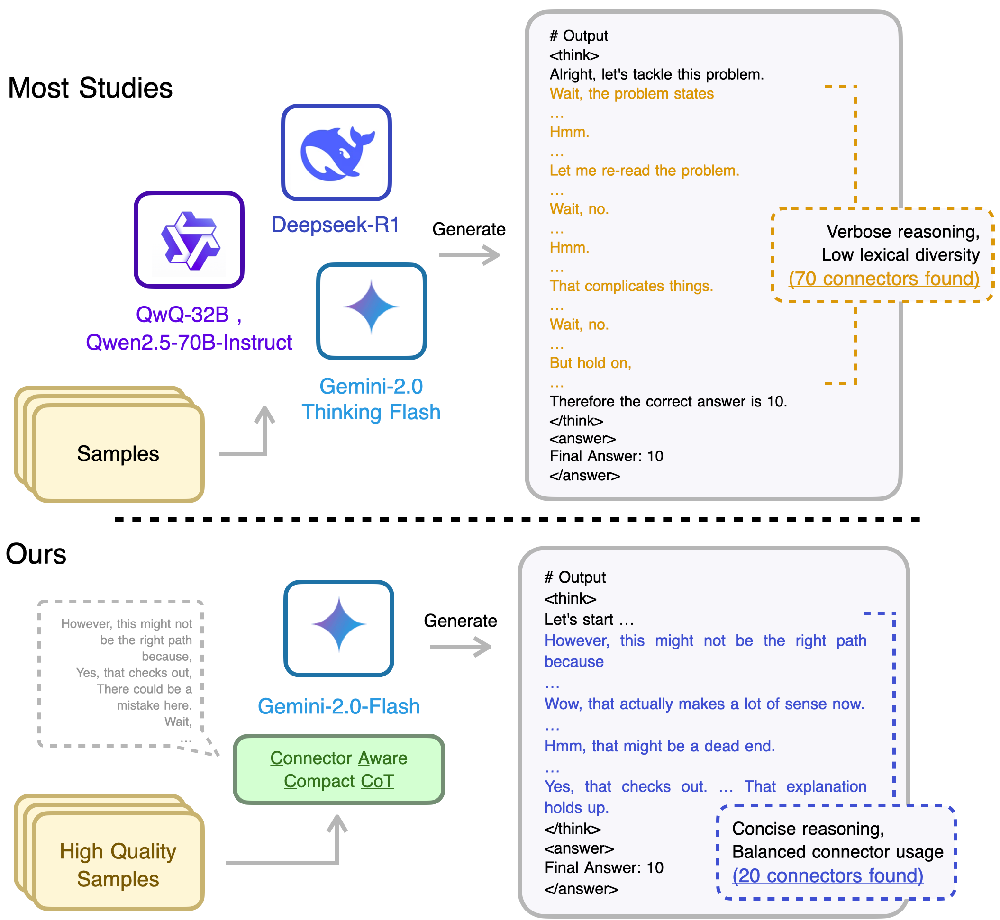

# CAC-CoT
Connector-Aware Compact CoT (Synthetic Method For Reasoning Data)

## Introduction

<br><br>

- **Last Updated:** 2025-05-26
- 본 프로젝트는 `CAC-CoT: Connector-Aware Compact Chain-of-Thought for Efficient Reasoning Data Synthesis Across Dual-System Cognitive Tasks`의 내용이며, **추론 데이터의 생성과 생성된 데이터를 기반으로 학습 및 평가** 코드를 담고 있습니다.
- 연결어와 길이 제약을 기반으로 추론 데이터를 합성함으로써 System-1 사고의 능력을 크게 증가시키고 System-2 사고 역시 이전 모델과 버금가는 추론 성능을 가질 수 있도록 한다.

---
**Updates**:
- (예정): 추론 모델 평가 코드 배포 (based s1_bench, system_2_eval)
- 2025-05-26: 추론 모델 학습 코드 배포 (based s1)
- 2025-05-23: CAC-CoT 데이터 합성 및 분석 코드 배포
---

## Artifacts
- Model: https://huggingface.co/datumo/CAC-CoT
- Data: https://huggingface.co/datasets/datumo/CAC-CoT

## Usage
### Quick Start

**Settings**
```python
git clone https://github.com/selectstar-ai/CAC-CoT.git
cd CAC-CoT
pip3 install -r requirements.txt
```

**CAC-CoT 데이터 생성**
```python
./run_synthetic.sh
```

**CAC-CoT 데이터 분석**
```python
./run_analysis.sh
```

**모델 학습(based s1)**
```python
src/s1/train/sft.sh
```

**모델 추론**
- (추가 예정)

### Results
- 데이터 합성(생성): `OUTPUT_DIR or HUGGINFACE_DIR`
- 합성 데이터 분석: `logs/evaluate`
- 모델 학습: `ckpts/`
- 모델 평가: (예정)

## 프로젝트 구조

```
├── config              # prompt, connector 
├── data                # 합성 데이터 로컬 저장 시 사용
├── LICENSE
├── logs                # 합성/분석 시 log 기록
│   ├── analysis
│   └── generate
├── notebook            # notebook 실험 코드
├── README.md
├── requirements.txt    
├── run_analysis.sh     # 분석 실행
├── run_synthetic.sh    # 합성 실행
├── src
│   ├── analysis.py     # 분석 코드
│   ├── s1              # 학습 코드/실행
│   ├── s1_bench        # 평가 코드/실행
│   └── synthetic.py    # 합성 코드
└── wandb
```