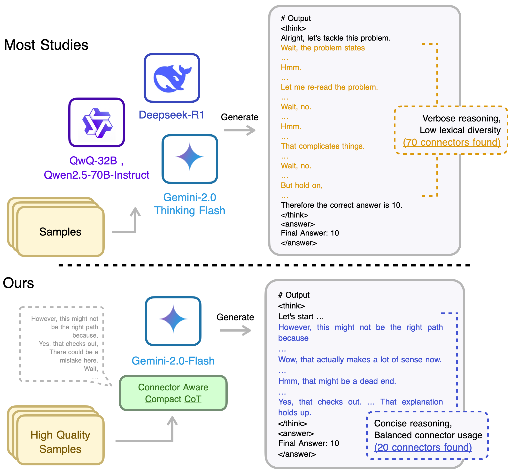

# CAC-CoT
Connector-Aware Compact CoT (Synthetic Method For Reasoning Data)

## Introduction

<br><br>

- **Last Updated:** 2025-12-30
- This project is based on CAC-CoT: Connector-Aware Compact Chain-of-Thought for Efficient Reasoning Data Synthesis Across Dual-System Cognitive Tasks, and contains code for **reasoning data generation, as well as training and evaluation based on the generated data.**
- By synthesizing reasoning data under connector and length constraints, the approach significantly enhances System-1 reasoning capabilities, while also enabling System-2 reasoning to achieve performance comparable to previous models.

---
**Updates**:
- 2025-12-30: Release of reasoning model system 2 evaluation code (S2 Bench)
- 2025-05-26: Release of reasoning model training code, and evaluation code (based on s1 and s1_bench)
- 2025-05-23: Release of CAC-CoT data synthesis and analysis code
---

## Artifacts
- Model: https://huggingface.co/datumo/CAC-CoT
- Data: https://huggingface.co/datasets/datumo/CAC-CoT

## Usage
### Quick Start

**Settings**
```bash
git clone https://github.com/selectstar-ai/CAC-CoT.git
cd CAC-CoT
pip3 install -r requirements.txt
pip3 install -e .
```

**CAC-CoT Data Generation**
```bash
bash run/run_synthetic.sh
```

**CAC-CoT Data Analysis**
```bash
bash run/run_analysis.sh
```

**Model Training (based s1)**
```bash
bash src/s1/train/sft.sh
```

**Evaluation**
- **S2 Bench**:
    ```bash
    bash run/run_s2_bench.sh <MODEL_PATH> [OUTPUT_FILE]
    ```
- **S1 Bench**:
    ```bash
    bash run/run_s1_bench.sh <MODEL_NAME> <MODEL_PATH>
    ```

### Results
- Data Synthesis (Generation) Results: `OUTPUT_DIR or HUGGINGFACE_DIR`
- Synthesized Data Analysis Results: `logs/evaluate`
- Model Training Results: `ckpts/`
- Model Evaluation Results: `outputs/` (S2 Bench) or `src/s1_bench/LRM_acc_eval/` (S1 Bench)

## Project Structure

```
├── configs             # Configuration files (models, connectors)
├── prompts             # Prompt templates (system, synthetic, grading)
├── data                # Used for storing synthesized data locally
├── figure              # Figures for README
├── LICENSE
├── logs                # Logs from synthesis/analysis
│   ├── analysis
│   └── generate
├── notebook            # Experimental notebooks
├── README.md
├── pyproject.toml      # Project metadata and dependencies
├── requirements.txt
├── run                 # Execution scripts
│   ├── run_analysis.sh 
│   ├── run_synthetic.sh
│   ├── run_s2_bench.sh
│   └── run_s1_bench.sh
├── scripts             # Analysis scripts
│   └── analysis.py
└── src
    ├── curation        # Data generation (synthetic.py)
    ├── evaluation      # Evaluation logic (eval.py, inference_and_check.py)
    ├── s1              # Training code
    ├── s1_bench        # S1 Bench evaluation logic
    └── utils           # Utility modules (config_loader.py)
```

## Citation
Please consider citing the following paper if our method and resources were helpful to your work.

```bibtex
@misc{choi2025caccotconnectorawarecompactchainofthought,
      title={CAC-CoT: Connector-Aware Compact Chain-of-Thought for Efficient Reasoning Data Synthesis Across Dual-System Cognitive Tasks}, 
      author={Sunguk Choi and Yonghoon Kwon and Heondeuk Lee},
      year={2025},
      eprint={2508.18743},
      archivePrefix={arXiv},
      primaryClass={cs.AI},
      url={https://arxiv.org/abs/2508.18743}, 
}
```

## Miscellaneous
For any questions regarding the code and/or the algorithm, please contact `sunguk.choi@selectstar.ai`
