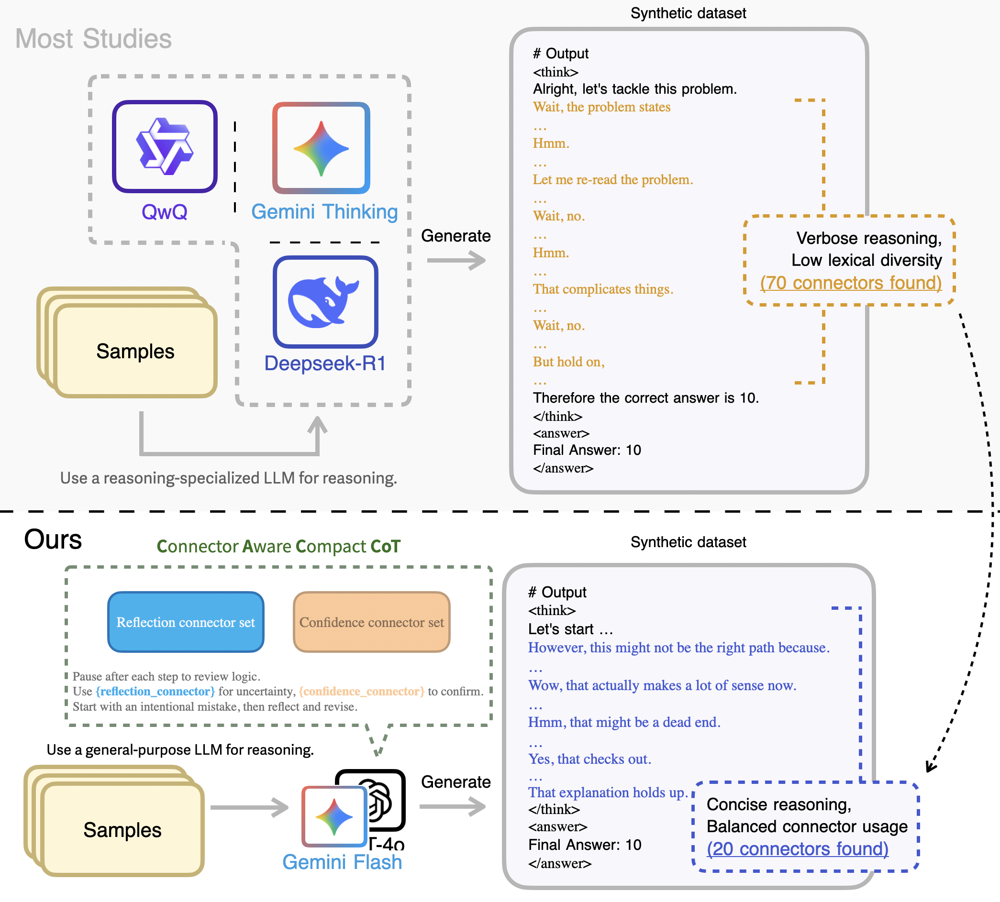

# CAC-CoT
Connector-Aware Compact CoT (Synthetic Method For Reasoning Data)

## Introduction

<br><br>

- **Last Updated:** 2025-05-26
- This project is based on CAC-CoT: Connector-Aware Compact Chain-of-Thought for Efficient Reasoning Data Synthesis Across Dual-System Cognitive Tasks, and contains code for **reasoning data generation, as well as training and evaluation based on the generated data.**
- By synthesizing reasoning data under connector and length constraints, the approach significantly enhances System-1 reasoning capabilities, while also enabling System-2 reasoning to achieve performance comparable to previous models.

---
**Updates**:
- (Planned): Release of reasoning model evaluation code (system_2_eval)
- 2025-05-26: Release of reasoning model training code, and evaluation code (based on s1 and s1_bench)
- 2025-05-23: Release of CAC-CoT data synthesis and analysis code
---

## Artifacts
- Model: https://huggingface.co/datumo/CAC-CoT
- Data: https://huggingface.co/datasets/datumo/CAC-CoT

## Usage
### Quick Start

**Settings**
```python
git clone https://github.com/selectstar-ai/CAC-CoT.git
cd CAC-CoT
pip3 install -r requirements.txt
```

**CAC-CoT Data Generation**
```python
./run_synthetic.sh
```

**CAC-CoT Data Analysis**
```python
./run_analysis.sh
```

**Model Training(based s1)**
```python
src/s1/train/sft.sh
```

**Model Inference**
- (Planned)

### Results
- Data Synthesis (Generation) Results: `OUTPUT_DIR or HUGGINFACE_DIR`
- Synthesized Data Analysis Results: `logs/evaluate`
- Model Training Results: `ckpts/`
- Model Evaluation Results: (Planned)

## 프로젝트 구조

├── config              # prompt, connector
├── data                # used for storing synthesized data locally
├── LICENSE
├── logs                # logs from synthesis/analysis
│   ├── analysis
│   └── generate
├── notebook            # experimental notebooks
├── README.md
├── requirements.txt    
├── run_analysis.sh     # run analysis
├── run_synthetic.sh    # run synthesis
├── src
│   ├── analysis.py     # analysis code
│   ├── s1              # training code/execution
│   ├── s1_bench        # evaluation code/execution
│   └── synthetic.py    # synthesis code
└── wandb
